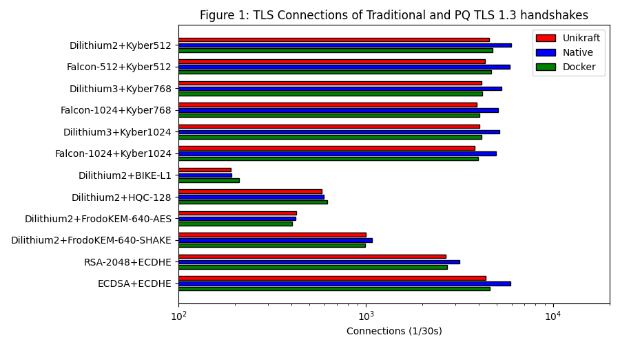
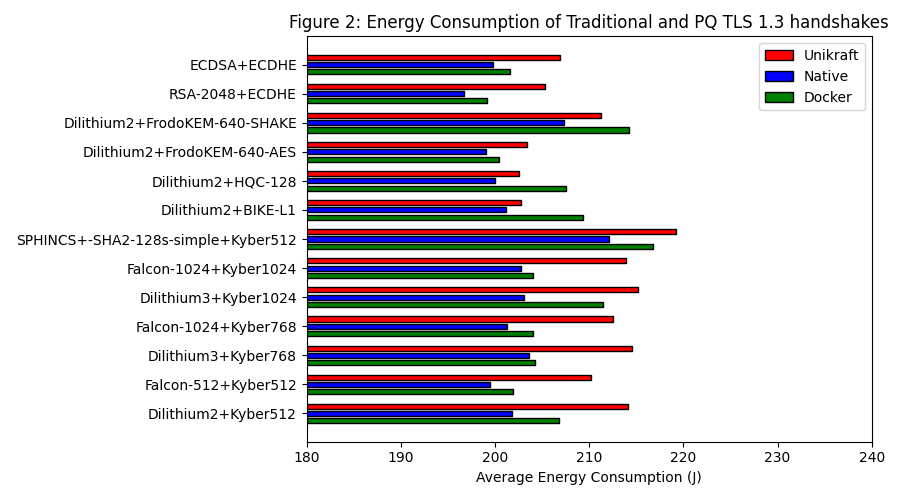

# Evaluating Post-Quantum Cryptography in Unikernels on Embedded Devices

This Interdisciplinary Project integrates the Post-Quantum Cryptography Library liboqs into the Unikraft Project and compares several performance metrics to a native solution and a containerized solution. 

Our first task was to evaluate the hardware at hand and choose a to industry standards comparable platform. We chose a Raspberry Pi 4 model, as it has wide development support and is ARM based making it more comparable to low-powered industrial hardware.

Our second task was to define use-cases which will be used as a basis for the evaluation. Since Post Quantum Cryptography's most important use case is TLS we opt for benchmarking the performance of network connections via TLS. 

Our third task was to define measurands to evaluate the performance. We measure the networking performance with TLS by the number of TLS connections per second and we measure the runtime of Post-Quantum Cryptography Primitives inside our virtual environment. During which we also take a look at overall power consumption, memory allocation.
Finally we evaluate the usabilty of the system by means of built time, toolchain complexity, etc.

We build a test setup in this repository which contains a configuration for a Unikraft Unikernel capable of post-quantum cryptographic primitives and a new OpenSSL version which can make use of those primitives. The repository also contains configurations for a Docker Container and a native setup which have the same solution running. For testing we use the openssl user application and its s_server and s_time components to test TLS connections. For primitives we use tests included in liboqs. 


# Setup

Clone the repo like this to avoid a large download size:

```sh
git clone --depth 1 git@gitlab.cc-asp.fraunhofer.de:aisec-pin/positron/epqciuoe.git
```


The first thing we need for the setup is a bridge as we use bridge networking for our Unikernel. To enable bridge networking run the following: 

```bash
sudo ip link add dev virbr0 type bridge
sudo ip address add 172.44.0.1/24 dev virbr0
sudo ip link set dev virbr0 up

sudo mkdir /etc/qemu
sudo echo "allow virbr0" > /etc/qemu/bridge.conf
```

The repository contains the 3 folders Container, Native, Unikraft which all contain a configuration for openssl (with liboqs). To build them first run the setup script:

```bash
./setup.sh 
```
 If you are on x86_64/amd64 run `docker run --rm --privileged multiarch/qemu-user-static --reset -p yes` as the setup script requires the entire setup to be build on arm64/aarch64. The script will generate a link to an openssl binary with the correct virtualization e.g. Unikraft/openssl runs openssl inside a Unikernel. Below are examples of how the s_server/s_time applications are used to measure the TLS connections. Before we can execute openssl s_server/s_time commands we need a public key infrastructure. The commands to establish such an infrastructure are also listed below. (Note: Unikernels are reachable via 172.44.0.1/24 and Containers via host.docker.internal)

```bash
Native/openssl req -x509 -new \
			-newkey dilithium3 \
			-keyout pki/CA_dil.key -out pki/CA_dil.crt \
			-nodes -subj "/CN=Test CA" -days 365

Native/openssl req -new \
			-newkey dilithium3 \
			-keyout pki/server_dil.key -out pki/server_dil.csr \
			-nodes -subj "/CN=testserver"

Native/openssl x509 -req \
			 -in pki/server_dil.csr -out pki/server_dil.crt \
			 -CA pki/CA_dil.crt -CAkey pki/CA_dil.key -CAcreateserial -days 365
```

```bash
Native/openssl s_server -key pki/server_dil.key -cert pki/server_dil.crt -accept 443 -www
Unikraft/openssl s_time -connect 172.44.0.1:443 -www / -CAfile pki/CA_dil.crt

Native/openssl s_server -key pki/server_dil.key -cert pki/server_dil.crt -accept 443 -www
Container/openssl s_time -connect host.docker.internal:443 -www / -CAfile pki/CA_dil.crt

Native/openssl s_server -key pki/server_dil.key -cert pki/server_dil.crt -accept 443 -www
Native/openssl s_time -connect localhost:443 -www / -CAfile pki/CA_dil.crt

```
 To execute tests (only for Unikraft) run: `Unikraft/test`


# Evaluation

The different virtualization mechanisms are evaluated in terms of performance of the cryptographic primitive operations and TLS performance. To measure the primitive operation's speed the setup script provides benchmark scripts that measure keygen/sign/verify and keygen/encapsulate/decapsulate operations of the oqs library:

```
Unikraft/benchmark sig --no_keygen --no_sign ECDSA
Native/benchmark kem -d 5 --no_keygen ECDHE
Container/benchmark kem --no_keygen --no_encaps Kyber512
```

To measure TLS performance openssl s_speed is used as seen in the commands above. Memory use is measured with top and power consumption is measured with an external measuring device. The exact parameters for the benchmark are documented in the `Benchmark/run_benchmarks.py` script. The results are saved in `Benchmark/results/`. Results are shown belown and in more detail in the report. 


### Speed

The figure shows the amount of connections that the openssl s_time application is able to make in a span of 30 seconds. Unikraft's performance is mostly on par with regular containerization and only sometimes performs slightly worse. 




### Power Consumption

The figure shows the amount of energy (J) that the openssl s_time application used in a span of 30 seconds disregarding the amount of connections made. If the connections are factored in the results look similar to the first figure. Energy consumption for both virtualization mechanisms is higher than a native application although there is no clear winner as the two perform different depending on the primitives. 


